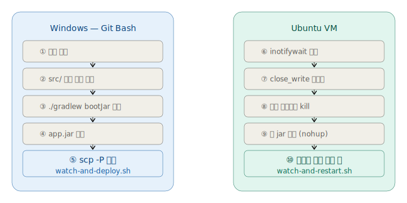

# 🚀 CI/CD 파이프라인 기초 다지기 실습

> Shell Script + inotifywait를 활용한 자동 빌드/배포 실습  
> Windows(Git Bash) → Spring Boot 빌드 → Ubuntu VM 자동 배포

---

## 📌 목차

1. [전체 아키텍처](#-전체-아키텍처)
2. [Shell Script 기본 문법](#-shell-script-기본-문법)
3. [자동 빌드 구현](#-자동-빌드-구현)
4. [자동 SCP 전송 구현](#-자동-scp-전송-구현)
5. [inotifywait 자동 감지 및 배포](#-inotifywait-자동-감지-및-배포)
6. [전체 스크립트](#-전체-스크립트)
7. [실무 CI/CD와 비교](#-실무-cicd와-비교)

---

## 🏗️ 전체 아키텍처



---

## 📖 Shell Script 기본 문법

### 1. Shebang (`#!`)

스크립트 **첫 줄**에 반드시 선언. 이 파일을 어떤 쉘로 실행할지 지정한다.

```bash
#!/bin/bash   # bash로 실행
#!/bin/sh     # sh로 실행 (더 호환성 높음)
```

> Git Bash는 Windows에서 `bash.exe`를 통해 `.sh` 파일을 해석한다.

---

### 2. 변수

```bash
# 선언 (= 양쪽에 공백 없어야 함!)
NAME="ubuntu"
PORT=2015

# 사용 ($를 붙임)
echo "$NAME"
echo "${NAME}_server"   # 문자열 붙일 때는 중괄호로 감쌈
```

| 구분 | 문법 | 예시 |
|------|------|------|
| 선언 | `변수명=값` | `USER="ubuntu"` |
| 사용 | `$변수명` | `echo $USER` |
| 안전한 사용 | `${변수명}` | `echo ${USER}_01` |

---

### 3. 조건문 (`if`)

```bash
if [ 조건 ]; then
    # 참일 때 실행
elif [ 다른조건 ]; then
    # 다른 조건 참일 때
else
    # 거짓일 때 실행
fi
```

**자주 쓰는 조건 연산자:**

```bash
# 문자열 비교
[ "$A" = "$B" ]    # 같다
[ "$A" != "$B" ]   # 다르다
[ -n "$A" ]        # 문자열이 비어있지 않다
[ -z "$A" ]        # 문자열이 비어있다

# 파일/디렉토리 확인
[ -f "$FILE" ]     # 파일이 존재한다
[ -d "$DIR" ]      # 디렉토리가 존재한다

# 숫자 비교
[ $A -eq $B ]      # 같다 (equal)
[ $A -ne $B ]      # 다르다 (not equal)
[ $A -gt $B ]      # A > B (greater than)
```

---

### 4. 반복문 (`while`)

```bash
while [ 조건 ]; do
    # 반복 실행
done

# 무한 루프
while true; do
    echo "계속 실행"
    sleep 5      # 5초 대기
done
```

---

### 5. 함수

```bash
# 함수 선언
함수명() {
    # 실행 내용
    echo "함수 실행됨"
}

# 함수 호출
함수명
```

---

### 6. 명령어 치환 (`$()`)

```bash
# 명령어 실행 결과를 변수에 저장
CURRENT_DATE=$(date '+%Y-%m-%d')
FILE_LIST=$(ls ./build/libs)

echo "오늘 날짜: $CURRENT_DATE"
```

---

### 7. 종료 코드 (`$?`)

```bash
# 바로 직전 명령어의 성공/실패 여부
./gradlew bootJar

if [ $? -eq 0 ]; then
    echo "✅ 성공 (종료코드 0)"
else
    echo "❌ 실패 (종료코드 0이 아님)"
fi
```

> 모든 Linux 명령어는 성공 시 `0`, 실패 시 `1 이상`을 반환한다.

---

### 8. 파이프 (`|`) 와 리다이렉션 (`>`)

```bash
# 파이프: 앞 명령어의 출력을 뒤 명령어의 입력으로
ls | sort | head -5

# 리다이렉션: 출력을 파일로 저장
echo "로그" > app.log      # 덮어쓰기
echo "추가" >> app.log     # 이어쓰기

# 표준에러(2)도 파일로 저장
java -jar app.jar > app.log 2>&1
#                            ↑ stderr(2)도 stdout(1)이 가는 곳으로
```

---

## 🔨 자동 빌드 구현

### 핵심 아이디어: 해시로 변경 감지

코드가 바뀌었는지 파악하기 위해 `src/` 폴더 전체 파일의 **MD5 해시**를 계산하고 이전 값과 비교한다.

```bash
# src/ 안의 모든 파일 해시를 합산 → 전체를 대표하는 해시값 하나 생성
CURRENT_HASH=$(find "$SRC_DIR" -type f | sort | xargs md5sum 2>/dev/null | md5sum)
```

**명령어 분해:**

```bash
find "$SRC_DIR" -type f   # src/ 안의 모든 파일 경로 출력
    | sort                # 경로를 정렬 (순서 일관성 보장)
    | xargs md5sum        # 각 파일의 MD5 해시 계산
    | md5sum              # 그 결과 전체를 다시 해시 → 대표 해시값 1개
```

**변경 감지 로직:**

```bash
LAST_HASH=""    # 이전 해시 (처음엔 빈 문자열)

while true; do
    CURRENT_HASH=$(find "$SRC_DIR" -type f | sort | xargs md5sum 2>/dev/null | md5sum)

    if [ "$CURRENT_HASH" != "$LAST_HASH" ]; then   # 해시가 다르면 = 코드 변경됨
        if [ -n "$LAST_HASH" ]; then                # 최초 실행은 빌드 스킵
            echo "🔄 변경 감지! 빌드 시작..."
            ./gradlew bootJar -q                    # 빌드 실행
        fi
        LAST_HASH="$CURRENT_HASH"                   # 해시 업데이트
    fi

    sleep 5   # 5초마다 반복
done
```

**흐름 요약:**

```
최초 실행
    └─ LAST_HASH = "" 저장 후 대기

코드 수정 후 5초 이내
    └─ CURRENT_HASH ≠ LAST_HASH
         └─ LAST_HASH가 비어있지 않음 → 빌드 실행!
              └─ ./gradlew bootJar -q
```

---

### Gradle 빌드 명령

```bash
./gradlew bootJar -q
#          ↑        ↑
#        실행 목표  quiet 모드 (불필요한 로그 생략)
```

**빌드된 jar 파일 찾기:**

```bash
# 버전명이 달라도 자동으로 찾음, plain jar 제외
BUILT_JAR=$(find ./build/libs -name "*.jar" ! -name "*plain*" | head -1)
```

---

## 📤 자동 SCP 전송 구현

### SCP란?

**Secure Copy Protocol** - SSH 기반으로 파일을 원격 서버에 안전하게 전송하는 명령어

```bash
scp [옵션] [보낼파일] [유저@호스트:저장경로]
```

### 주요 옵션

| 옵션 | 설명 | 예시 |
|------|------|------|
| `-P` | 포트 지정 **(대문자!)** | `-P 2015` |
| `-r` | 폴더째로 전송 | `-r ./dist` |
| `-i` | SSH 키 파일 지정 | `-i ~/.ssh/id_rsa` |

> ⚠️ `ssh`는 소문자 `-p`, `scp`는 **대문자 `-P`** — 가장 헷갈리는 부분!

### 실제 사용 코드

```bash
REMOTE_USER="ubuntu"
REMOTE_HOST="127.0.0.1"
REMOTE_PORT="2015"          # VirtualBox 포트포워딩
REMOTE_DIR="/home/ubuntu/deploy"
JAR_NAME="app.jar"

scp -P "$REMOTE_PORT" "$BUILT_JAR" \
    "$REMOTE_USER@$REMOTE_HOST:$REMOTE_DIR/$JAR_NAME"
#    ↑                           ↑
# 보낼 파일                  원격 저장 경로
```

### VirtualBox NAT 환경에서 접속 주소

```
VM 내부 IP:  10.0.2.15      ← Windows에서 직접 접근 불가 ❌
실제 접속:   127.0.0.1:2015  ← 포트포워딩을 통해 접근 ✅

Windows:2015 → VirtualBox NAT → VM:22(SSH)
```

### SSH 키 등록 (비밀번호 없이 자동화)

```bash
# 1. 키 생성 (Windows Git Bash에서)
ssh-keygen -t rsa -b 4096
#                 ↑ 키 강도 (비트)

# 2. 공개키를 Ubuntu에 등록 (한 번만 비번 입력)
ssh-copy-id -p 2015 ubuntu@127.0.0.1

# 3. 이후 비번 없이 접속 확인
ssh -p 2015 ubuntu@127.0.0.1
```

**키 쌍 원리:**

```
[Windows]                        [Ubuntu]
  🔑 개인키 (id_rsa)               🔓 공개키 (id_rsa.pub)
  "나만 가진 열쇠"       →         ~/.ssh/authorized_keys 에 등록
  절대 공유 X                      "이 열쇠로 열 수 있는 자물쇠"
```

---

## 👁️ inotifywait 자동 감지 및 배포

### inotifywait란?

Linux 커널의 **inotify** 기능을 활용해 파일/디렉토리의 변경을 **실시간으로 감지**하는 도구

```bash
# 설치
sudo apt install inotify-tools -y

# 기본 사용법
inotifywait -m -e [이벤트] [감시경로]
#            ↑  ↑
#         계속 감시  이벤트 종류
```

### 주요 이벤트 종류

| 이벤트 | 발생 시점 | 비고 |
|--------|-----------|------|
| `create` | 파일 생성 시작 | 전송 중일 수 있음 ⚠️ |
| `close_write` | 파일 쓰기 완료 후 닫힘 | 전송 완료 후 ✅ |
| `modify` | 파일 내용 수정 시 | 여러 번 발생 가능 |
| `delete` | 파일 삭제 시 | |
| `moved_to` | 파일이 해당 경로로 이동 시 | |

### ⭐ close_write를 쓰는 이유

```
scp 전송 시작
    ↓
create 이벤트 발생     ← ❌ 이때 실행하면 파일이 불완전! 앱 깨짐
    ↓
파일 데이터 전송 중...
    ↓
전송 완료
    ↓
close_write 이벤트 발생  ← ✅ 파일이 완전히 써진 후! 여기서 실행
```

### inotifywait 감지 스크립트 분해

```bash
inotifywait -m -e close_write "$DEPLOY_DIR" |
while read dir event file; do
#           ↑    ↑      ↑
#         경로  이벤트  파일명

    if [ "$file" = "app.jar" ]; then   # app.jar일 때만 반응
        echo "📦 새 app.jar 감지!"
        stop_app   # 기존 프로세스 종료
        sleep 1
        start_app  # 새 jar 실행
    fi
done
```

### nohup & PID 파일 관리

```bash
start_app() {
    # nohup: 터미널 종료해도 백그라운드에서 계속 실행
    # &: 백그라운드 실행
    nohup java -jar "$JAR_FILE" > "$LOG_FILE" 2>&1 &

    # $!: 방금 실행한 프로세스의 PID
    echo $! > "$PID_FILE"   # PID를 파일로 저장
}

stop_app() {
    PID=$(cat "$PID_FILE")   # 저장된 PID 읽기
    kill "$PID"              # 해당 프로세스 종료
    rm -f "$PID_FILE"        # PID 파일 삭제
}
```

**nohup 실행 흐름:**

```
nohup java -jar app.jar > app.log 2>&1 &
  ↑                        ↑      ↑   ↑
터미널 끊겨도            로그파일  에러도  백그라운드
계속 실행               저장      저장    실행
```

---

## 📄 전체 스크립트

### `watch-and-deploy.sh` (Windows Git Bash에서 실행)

```bash
#!/bin/bash

# ==========================================
# ✏️ 환경에 맞게 수정
# ==========================================
REMOTE_USER="ubuntu"
REMOTE_HOST="127.0.0.1"
REMOTE_PORT="2015"
REMOTE_DIR="/home/ubuntu/deploy"
JAR_NAME="app.jar"
SRC_DIR="./src"
# ==========================================

LAST_HASH=""

echo "========================================"
echo " 🚀 자동 빌드/배포 스크립트 시작"
echo " 대상 서버: $REMOTE_HOST:$REMOTE_PORT"
echo "========================================"

while true; do

    CURRENT_HASH=$(find "$SRC_DIR" -type f | sort | xargs md5sum 2>/dev/null | md5sum)

    if [ "$CURRENT_HASH" != "$LAST_HASH" ]; then

        if [ -n "$LAST_HASH" ]; then
            echo ""
            echo "🔄 [$(date '+%H:%M:%S')] 변경 감지! 빌드 시작..."

            ./gradlew bootJar -q

            if [ $? -eq 0 ]; then
                echo "✅ 빌드 성공!"

                BUILT_JAR=$(find ./build/libs -name "*.jar" ! -name "*plain*" | head -1)

                echo "📤 전송 중..."
                scp -P "$REMOTE_PORT" "$BUILT_JAR" \
                    "$REMOTE_USER@$REMOTE_HOST:$REMOTE_DIR/$JAR_NAME"

                if [ $? -eq 0 ]; then
                    echo "🎉 [$(date '+%H:%M:%S')] 배포 완료!"
                else
                    echo "❌ 전송 실패"
                fi
            else
                echo "❌ 빌드 실패"
            fi
        else
            echo "✅ 초기 상태 저장. 코드 변경 감지 대기 중..."
        fi

        LAST_HASH="$CURRENT_HASH"
    fi

    sleep 5

done
```

---

### `watch-and-restart.sh` (Ubuntu VM에서 실행)

```bash
#!/bin/bash

DEPLOY_DIR="/home/ubuntu/deploy"
JAR_FILE="$DEPLOY_DIR/app.jar"
LOG_FILE="$DEPLOY_DIR/app.log"
PID_FILE="$DEPLOY_DIR/app.pid"

start_app() {
    echo "🟢 [$(date '+%H:%M:%S')] 앱 시작..."
    nohup java -jar "$JAR_FILE" > "$LOG_FILE" 2>&1 &
    echo $! > "$PID_FILE"
    echo "   PID: $(cat $PID_FILE)"
}

stop_app() {
    if [ -f "$PID_FILE" ]; then
        PID=$(cat "$PID_FILE")
        echo "🔴 [$(date '+%H:%M:%S')] 기존 앱 종료 (PID: $PID)..."
        kill "$PID" 2>/dev/null
        sleep 2
        rm -f "$PID_FILE"
    fi
}

echo "========================================"
echo " 👀 inotifywait 감지 시작"
echo " 감시 경로: $DEPLOY_DIR"
echo "========================================"

start_app

inotifywait -m -e close_write "$DEPLOY_DIR" |
while read dir event file; do
    if [ "$file" = "app.jar" ]; then
        echo ""
        echo "📦 [$(date '+%H:%M:%S')] 새 app.jar 감지! ($event)"
        stop_app
        sleep 1
        start_app
    fi
done
```

---

## 🔄 실무 CI/CD와 비교

| 이번 실습 | 실무 도구 | 역할 |
|-----------|-----------|------|
| `md5sum` 해시 변경 감지 | Git push webhook | 변경 트리거 |
| `./gradlew bootJar` | Jenkins Build Stage | 빌드 |
| `scp` 파일 전송 | Artifact 업로드 / S3 | 배포 파일 전달 |
| `inotifywait` 재시작 | Kubernetes Rolling Update | 무중단 재배포 |
| `PID` 파일 관리 | systemd / Docker | 프로세스 관리 |
| `nohup` 백그라운드 실행 | Docker Container | 서비스 유지 |

---

## 🛠️ 기술 스택


---

## 📝 핵심 정리

```
✅ Shell Script  = 명령어를 파일로 묶어 자동화한 텍스트 파일
✅ Shebang       = 첫 줄 #!/bin/bash, 어떤 쉘로 실행할지 선언
✅ 변경 감지     = md5sum 해시 비교로 src/ 코드 변경 탐지
✅ close_write   = scp 전송 완료 후 발생하는 이벤트 (create 말고 이걸 써야 안전)
✅ scp -P        = 포트 옵션은 대문자 P (ssh는 소문자 p)
✅ nohup &       = 터미널 꺼져도 백그라운드에서 계속 실행
✅ $?            = 직전 명령어 성공(0) / 실패(1이상) 코드
✅ $!            = 방금 실행한 백그라운드 프로세스의 PID
```